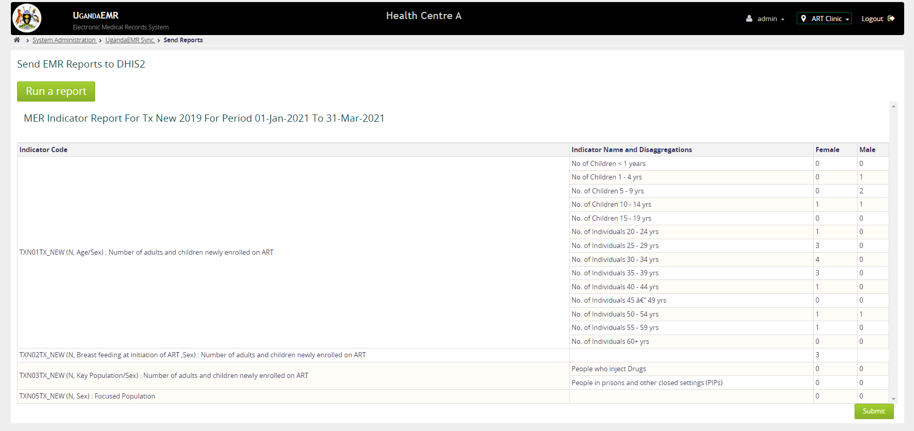

## SENDING AGGREGATE REPORTS TO DHIS2 (NEXT GENERATION REPORTING)

### Introduction
This exchange enables one to send UgandaEMR auto generated reports to a specific reporting system instance such as eHMIS,PIRS.

This means one doesn't have to first generate a report from the EMR, print and then enter it in another system which can be error prone
Currently this exchange supports sending of HMIS Reports and PEPFAR MER Reports. 

### Configuration
The exchange requires one to have an account with a reporting system they plan to report to e.g. eHMIS DHIS2 account.
A username and password of this account will be required in our set up.
Once we have this, we can follow the steps below:
 
1. Login in UgandaEMR with an account that has  administrator rights to the system. This will navigate you to the home page of UgandaEMR. 

2. Click on the ” System Administrator” Icon. This will navigate you to the System Administrator Page.

3. Click on the “UgandaEMR Sync" Icon. This will navigate you to the ugandaemr sync settings page. 

4. Click on the “Sync Task Type” icon. This will navigate you to the Sync task Type Config Page. With a table showing the different exchange settings.

5. Here we have two sync task types we interested in i.e. Send Next Gen Reports(For PEPFAR Reporting) and the Send HMIS Reports (For HMIS reporting ) 

6. Click on the edit icon under the “ACTION” column on the task type you are interested in. This will popup a dialogue box.

7. In the dialogue box enter the username and password provided in the respective fields.

8. Click on the “save” button to save the changes.

9. Ensure also to have your facility DHIS2 UUID set. Click here to know how to set it up.

Now we are set to send our reports directly to another system

### Steps to Send a Report
1. Login into UgandaEMR with an account that has  administrator rights to the system 

2. Click on the "System Administrator" Icon then click on the "UgandaEMR Sync" Icon. This will navigate you to the ugandaemr sync settings page. . This will navigate you to the System Administrator Page.

3. Click on the "Send Aggregate Reports" Icon. This will navigate you to the ugandaemr sync settings page. 
 

4. Click on Run a Report. This will drop a dialogue box select. Select the report you would like to generate and the period.

5. Click Run and wait for the report to be generated 
 
6. Once the report is successfully run, the report data will be displayed as shown below 

 
7. Validate the values in the report to ensure that what is generated is what is expected and after click "Submit" to send the report.

8. Once the report is sent successfully, a message showing "Report successfully sent" will appear 

### SYNC TASK LOGS
Every time a report is sent, the EMR records this action in the Sync Task Logs showing the date it was sent, the status of the task i.e whether it was successful or not. 
A Status code is also captured to help in troubleshooting in case there was a failure in sending the report

Sync Task Logs are found under Home > System Administrator > UgandaEMR Sync >Sync  Task Logs 

